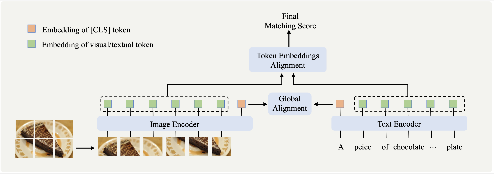

# Token Embeddings Alignment for Cross-Modal Retrieval

PyTorch implementation and pretrained models of TEAM.
A new dataset which contains over 100M Chinese image-text pairs will also be released.



## Citation
If you find this repository useful, please consider citing our paper:
```
@inproceedings{TEAM2022MM,
  title = {Token Embeddings Alignment for Cross-Modal Retrieval},
  author = {Xie, Chen-Wei and Wu, Jianmin and Zheng, Yun and Pan, Pan and Hua, Xian-Sheng},
  booktitle = {ACMMM},
  year = {2022}
}
```
